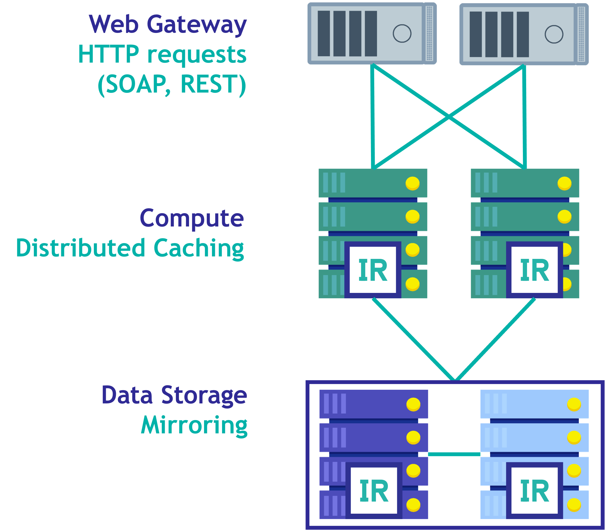

# Setup

## Requirements
* Have a look at [Getting Started with Amazon EKS](https://docs.aws.amazon.com/eks/latest/userguide/getting-started.html)

* Install [kubectl 1.21](https://docs.aws.amazon.com/eks/latest/userguide/install-kubectl.html), [eksctl](https://docs.aws.amazon.com/eks/latest/userguide/eksctl.html) and [AWS CLI](https://docs.aws.amazon.com/cli/latest/userguide/cli-chap-install.html).

* Create an AWS IAM user with at least [minimum iam policies for EKS](https://eksctl.io/usage/minimum-iam-policies/)

* [Configure](https://docs.aws.amazon.com/cli/latest/userguide/cli-configure-quickstart.html#cli-configure-quickstart-config) your AWS CLI to use your EKS enabled user.

## Create EKS cluster
Go to k8s folder:
```
cd k8s
```

Create an EKS cluster with some nodes:
```
eksctl create cluster --name afuentes-webinar-k8s-ha --nodes 3 --version 1.21 --node-type t2.medium  --region eu-west-1 --ssh-access
```

## Install IKO (InterSystems Kubernetes Operator)
* Create a secret called `intersystems-pull-secret` to pull images from intersystems container repository:
```
kubectl create secret docker-registry intersystems-pull-secret \
--docker-server=https://containers.intersystems.com \
--docker-username='<username>' \
--docker-password='<password>' \
--docker-email='<email>'
```

* Download & unzip `iris_operator-3.3.0.120` from [WRC SW Distribution](https://wrc.intersystems.com/wrc/coDistGen.csp).

* Edit `iris_operator-3.3.0.120/chart/iris-operator/values.yaml` file, and update imagePullSecrets section as:
```
imagePullSecrets:
  - name: intersystems-pull-secret
```

* Install IKO chart using `helm` in your AWS EKS cluster:
```
helm install intersystems iris_operator-3.3.0.120/chart/iris-operator
```

* After that, show running pods, you should see InterSystems IRIS Operator:
```
kubectl get pods
```

# Deploy IRIS in Kubernetes

## Create secrets
Define a secret for the IRIS license:
```
kubectl create secret generic iris-key-secret --from-file=iris.key
```

## Create iris-cpf config map
Create a config-map for configuration files:
```
kubectl create cm iris-cpf --from-file common.cpf --from-file data.cpf --from-file compute.cpf --from-file CSP.ini
```

## Storage
Define storage class:
```
kubectl apply -f storage.yaml
```

## Deploy
* Have a look at the [iris.yaml](k8s/iris.yaml) configuration.

* Deploy the InterSystems IRIS configuration:
``` 
kubectl apply -f iris.yaml
```

* Show running pods
```
kubectl get pods
NAME                                          READY   STATUS    RESTARTS   AGE
intersystems-iris-operator-84568955dc-mm6gg   1/1     Running   0          17m
webinar-arbiter-0                             1/1     Running   0          13m
webinar-compute-0                             1/1     Running   0          5m53s
webinar-compute-1                             1/1     Running   0          3m12s
webinar-data-0-0                              1/1     Running   0          12m
webinar-data-0-1                              1/1     Running   0          10m
webinar-webgateway-0                          1/1     Running   0          101s
webinar-webgateway-1                          0/1     Running   0          50s
```

* Show services, pay attention to the services that references LoadBalancers to webgateways, compute and data pods.
```
kubectl get svc
NAME                         TYPE           CLUSTER-IP       EXTERNAL-IP                                                               PORT(S)                          AGE
ecp-service                  LoadBalancer   10.100.221.197   aaa5ff964a875403f8d412fb7452adb6-471642292.eu-west-1.elb.amazonaws.com    1972:32665/TCP,52773:32276/TCP   13m
intersystems-iris-operator   ClusterIP      10.100.13.53     <none>                                                                    443/TCP                          17m
iris-svc                     ClusterIP      None             <none>                                                                    <none>                           13m
kubernetes                   ClusterIP      10.100.0.1       <none>                                                                    443/TCP                          41m
webgateway-service           LoadBalancer   10.100.158.12    aaab9045e05d8410aa8cb9a66ed348b0-1326787197.eu-west-1.elb.amazonaws.com   80:31840/TCP                     13m
webinar                      LoadBalancer   10.100.153.110   aaad50e7786e440d19c59f9fb82e0ae2-1725045822.eu-west-1.elb.amazonaws.com   1972:30645/TCP,52773:32655/TCP   13m
webinar-webgateway           LoadBalancer   10.100.191.167   aaa936e8c427d42c996aa24cf9c7f136-1002690704.eu-west-1.elb.amazonaws.com   80:31857/TCP                     6s
```

* After initialization is completed, you should be able to access to:
  * Data pods - http://webinar-lb:52773/csp/sys/UtilHome.csp
  * Compute pods - http://compute-service-lb:52773/csp/sys/UtilHome.csp
  * Webgateway pods - http://webgateway-service-lb/


* You can even connect to a specific pod in a interactive shell:
```
kubectl exec --stdin --tty webinar-data-0-0 -- /bin/bash
```

# Run some tests

Keep in mind that in a real environment you could just pull your own Docker image with your application.

In this case, for the sake of simplicity, we will load some code and create web applications.

## Load code in the IRIS instance
* We will load & compile some test code in IRIS
* Using Visual Code, set up a connection to your data pod and load and compile the code in `/src`.

## Create web applications
* Connect to `webinar-data-0-0`, `webinar-data-0-1`, `webinar-compute-0` and `webinar-compute-1` and create a simple test web application using:
```
write ##class(API.Util).CreateWebApp("IRISCLUSTER", "/external/person", "API.RestHandler")
```

## Python client (NativeAPI)
Try running a simple Python (NativeAPI) example that will connect to your compute-lb.

Install nativeAPI (Python)
```
pip3 install nativeAPI_wheel/irisnative-1.0.0-cp34-abi3-linux_x86_64.whl 
```

Create an `client\ingest.ini` file and set up python client configuration like:
```
[iris]
ip = <compute-service-lb>
port = 1972
namespace = IRISCLUSTER
username = superuser
password = <password>
```

Run the client:
```
cd client
python ingest.py

Connected
Inserting data...
id = 139
id = 140
id = 141
id = 142
id = 143
...
```

Now, while inserting data try to delete you Primary Data pod:
```
kubectl delete pod webinar-data-0-0
```

Have a look at the Mirror Monitor in the Data Management Portal and check what happened.

Check how Kubernetes has already started again the pod for you.

## REST API
* Have a look at the simple REST API in [src/API/RestHandler.cls](src/API/RestHandler.cls).
* Open Postman, load [client/webinar-k8s-ha.postman_collection.json](client/webinar-k8s-ha.postman_collection.json) and check the request.
* The request will use webgateway-lb as target.

# Delete Kubernetes deployment

After you have finished testing your deployment, you can delete it.

Go to k8s folder:
```
cd k8s
```

Delete the InterSystems IRIS deployment:
```
kubectl delete -f iris.yaml
```

Delete persistent volumes:
```
kubectl delete pvc $(kubectl get pvc -o name | cut -d/ -f2)
```

Delete iris service:
```
kubectl delete service iris-svc
```

Optionally, you can even uninstall IKO:
```
helm uninstall intersystems
```

And finally, delete the AWS EKS cluster: 
```
eksctl delete cluster --name afuentes-webinar-k8s-ha --region eu-west-1
```

